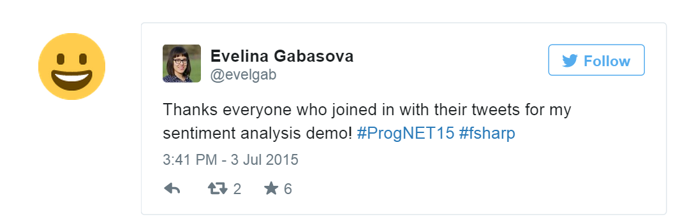

Sentiment analysis of tweets
============================================
Demo and slides presented at [Progressive .NET tutorials](https://skillsmatter.com/conferences/6859-progressive-dotnet-2015), July 2015 in London.

To access Twitter data, you will first have to register an app to obtain `secret` and `key`: [register Twitter app](https://apps.twitter.com/app/new).

To run sentiment analysis, download also the [Stanford NLP Parser](http://nlp.stanford.edu/software/lex-parser.shtml) and unzip it in the same directory as the code.

